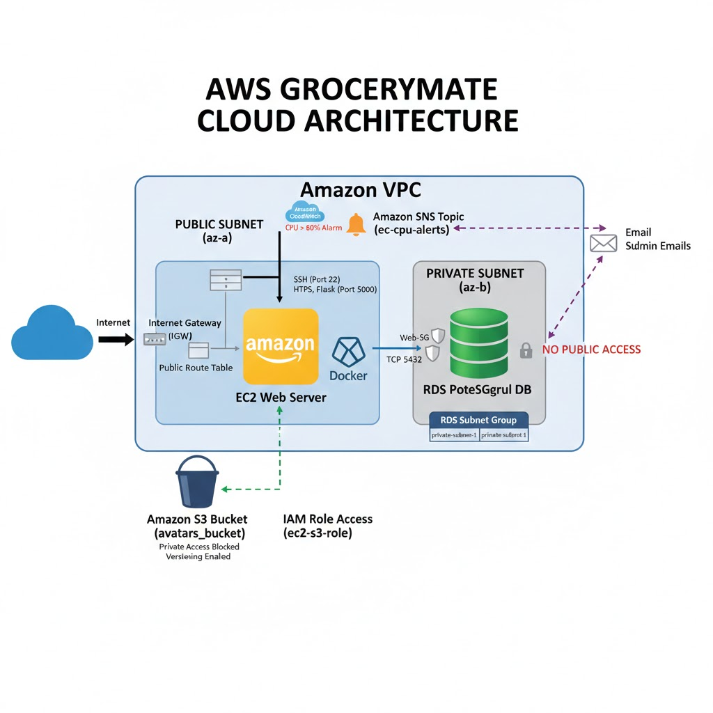

# 🛒 GroceryMate Cloud Platform

## 🚀 The Vision

**GroceryMate** is a high-performance, cloud-native e-commerce solution engineered for scalability and reliability. By leveraging **Infrastructure as Code (IaC)**, I've built a platform that isn't just an app—it's a fully automated ecosystem.

⭐ If you find this project useful, feel free to star the repository.

---

## 🧭 Mission Control

*Click any badge to jump directly to that section.*

| 🌐 STRATEGY | 🏗️ ARCHITECTURE | 🛠️ IMPLEMENTATION |
| :---: | :---: | :---: |
| [](#-project-genesis) | [](#%EF%B8%8F-system-design) | [](#-prerequisites) |
| [](#-core-capabilities) | [](#-app-preview) | [](#%EF%B8%8F-deployment-flow) |
| [](#-user-manual) | [](#%EF%B8%8F-future-roadmap) | [](#-license) |

---

## 🚀 Project Genesis

**GroceryMate** is a cloud-based e-commerce application for online grocery shopping. The project focuses on **AWS cloud deployment, Terraform-managed infrastructure, and backend development**, with specific attention to cost optimization, scalability, and security.

Users can browse products, manage a shopping basket, and complete purchases through a secure backend. This project serves as a practical deep-dive into **Infrastructure as Code** to automate modern cloud environments.

---

## 🛒 Core Capabilities

- **🛡️ User Authentication**: Secure registration and login with JWT
- **🔒 Protected Routes**: Ensure only authenticated users access sensitive pages
- **🔎 Product Search & Filtering**: Browse, filter, and sort products by category or price
- **⭐ Favorites Management**: Save preferred products
- **🛍️ Shopping Basket**: Add, view, modify, and remove items
- **💳 Checkout Process**: Secure billing, multiple payment options, and automatic total price calculation

---

## 🏗️ System Design

### Architecture

This project includes Terraform-managed infrastructure for AWS:

- Provision EC2 instances for backend
- Manage PostgreSQL and storage resources
- Implement cost-efficient and scalable architecture
- Infrastructure can be recreated easily using Infrastructure as Code

#### 📋 Technology Stack

| Component              | Technology | Version / Engine                |
| ---------------------- | ---------- | ------------------------------- |
| Backend                | Python     | **3.11+**                       |
| Web Framework          | Flask      | Latest (via `requirements.txt`) |
| Database               | PostgreSQL | **14+** (Engine: `postgres`)    |
| Frontend               | JavaScript | React-based                     |
| Cloud Provider         | AWS        | Configurable Region             |
| Infrastructure as Code | Terraform  | **≥ 1.5**                       |
| Storage                | Amazon S3  | Standard + Versioning           |
| Authentication         | JWT        | HS256                           |


#### 🐳 Docker (Planned)

Docker support is planned to simplify local development and deployment.

Future Docker usage will include:
- Containerized Flask backend
- PostgreSQL service via Docker Compose
- Consistent development environments

#### 🏗 Terraform Infrastructure Commands

All AWS infrastructure is managed using Terraform.

**Initialize Terraform:**
```bash
terraform init
```

**Preview Changes:**
```bash
terraform plan
```

**Apply Infrastructure:**
```bash
terraform apply
```

Terraform provisions:
- Amazon S3 bucket (avatars + versioning)
- IAM roles & policies
- PostgreSQL RDS
- Networking resources (VPC-related components)

#### 🏗 Architecture Diagram

The following diagram illustrates the high-level architecture of the GroceryMate cloud platform deployed on AWS.



---

## 📸 App Preview


---

## 📋 Prerequisites

Ensure the following are installed and configured:

- **🐍 Python 3.11+**
- **🐘 PostgreSQL** (Engine 14+ for local data storage)
- **🛠️ Git**
- **☁️ AWS CLI** (Configured with appropriate IAM permissions)
- **🌍 Terraform ≥ 1.5**

---

## ⚙️ Deployment Flow

### 1️⃣ Clone Repository

```bash
git clone --branch version2 https://github.com/AlejandroRomanIbanez/AWS_grocery.git
cd AWS_grocery
```

### 2️⃣ Configure PostgreSQL

Create your database and user. Replace `<password>` with a strong password.

```bash
# Create database
psql -U postgres -c "CREATE DATABASE <database_name>;"

# Create user with encrypted password
psql -U postgres -c "CREATE USER <username> WITH ENCRYPTED PASSWORD '<password>';"

# Grant privileges
psql -U postgres -c "ALTER USER <username> WITH SUPERUSER;"
```

### 3️⃣ Populate Database

```bash
# Seed the data
psql -U <username> -d <database_name> -f <path_to_sql_file>

# Verify data
psql -U <username> -d <database_name> -c "SELECT * FROM users;"
psql -U <username> -d <database_name> -c "SELECT * FROM products;"
```

### 4️⃣ Python Environment

```bash
cd backend
python3 -m venv venv && source venv/bin/activate
pip install -r requirements.txt
```

### 5️⃣ Environment Variables (.env)

Create a `.env` file in the backend folder:

```bash
touch .env  # macOS/Linux
# ni .env -Force  # Windows
```

Edit the `.env` file:

```bash
nano .env
```


### 6️⃣ Authentication

Generate a secure JWT secret key:

```bash
python3 -c "import secrets; print(secrets.token_hex(32))"
```

Copy the generated key and add it to your `.env` file as `JWT_SECRET_KEY`.

Then configure your `.env` file as follows:

```ini
# ------------------------
# Authentication
# ------------------------
JWT_SECRET_KEY=<your_jwt_secret_key>

# ------------------------
# PostgreSQL Database
# ------------------------
POSTGRES_USER=<your_postgres_username>
POSTGRES_PASSWORD=<your_postgres_password>
POSTGRES_DB=<your_postgres_database_name>
POSTGRES_HOST=<your_postgres_host>
POSTGRES_URI=postgresql://${POSTGRES_USER}:${POSTGRES_PASSWORD}@${POSTGRES_HOST}:5432/${POSTGRES_DB}

# ------------------------
# AWS Configuration
# ------------------------
AWS_REGION=<aws_region>
AWS_ACCESS_KEY_ID=<aws_access_key_id>
AWS_SECRET_ACCESS_KEY=<aws_secret_access_key>

# ------------------------
# S3 Bucket for User Files
# ------------------------
S3_BUCKET_NAME=<s3_bucket_name>
S3_BUCKET_REGION=<s3_bucket_region>
S3_AVATAR_PREFIX=<s3_avatar_prefix>

# ------------------------
# EC2 Key Pair
# ------------------------
EC2_KEY_NAME=<ec2_key_pair_name>
PUBLIC_KEY_PATH=<path_to_public_key_file>

# ------------------------
# Optional: Flask Environment
# ------------------------
FLASK_ENV=<flask_environment>
ENVIRONMENT=<environment_name>
```


### 7️⃣ Start the Application

```bash
python3 run.py
```

---

## 📚 User Manual

- Access the application at [http://localhost:5000](http://localhost:5000)
- Register/Login to your account
- Browse and search for products
- Manage favorites and shopping basket
- Proceed through the checkout process

---

## 🛣️ Future Roadmap

### Planned Features & Improvements

- **🐳 Docker Containerization**: Full Docker and Docker Compose support for simplified deployment
- **🔄 CI/CD Pipeline**: Automated testing and deployment using GitHub Actions or AWS CodePipeline
- **📊 Analytics Dashboard**: Admin panel with sales analytics, user behavior tracking, and inventory management
- **🔔 Real-time Notifications**: WebSocket integration for order updates and promotional alerts
- **💳 Payment Gateway Integration**: Stripe, PayPal, and other payment providers
- **📱 Mobile Application**: Native iOS and Android apps for enhanced user experience
- **🤖 AI-Powered Recommendations**: Machine learning-based product suggestions
- **🌐 Multi-region Deployment**: CDN integration and global infrastructure expansion
- **🔍 Advanced Search**: Elasticsearch integration for faster, more accurate product searches
- **📦 Order Tracking**: Real-time delivery tracking and status updates
- **⚡ Performance Optimization**: Implement caching strategies (Redis/ElastiCache)
- **🛡️ Enhanced Security**: Two-factor authentication, rate limiting, and security audits
- **📈 Auto-scaling**: Dynamic EC2 instance scaling based on traffic patterns

---

## 📄 License

This project is licensed under the MIT License.

---
